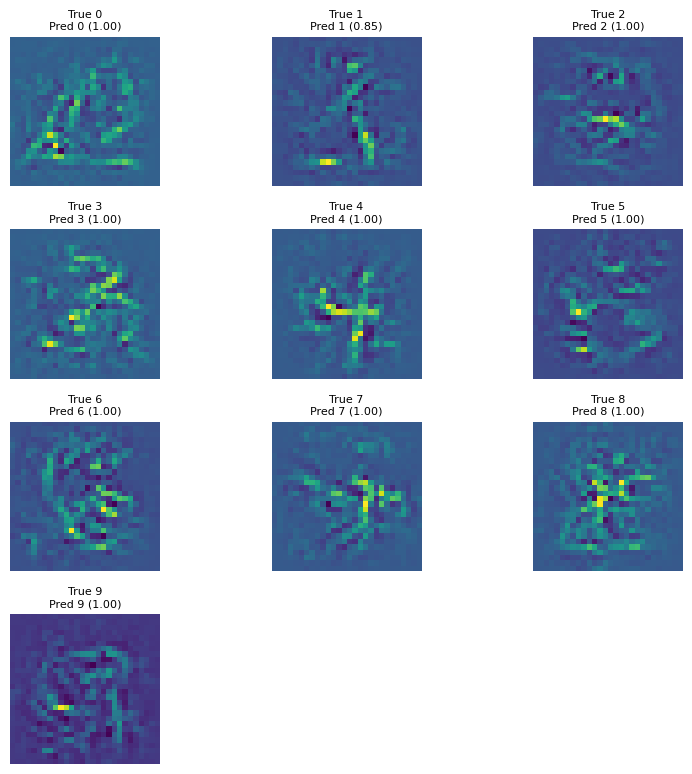

# Tensorflow Adversarial Example Training

This project is a spin off of a [much larger research project](https://github.com/hmcalister/Tensorflow-Intepretability-Project) undertaken at the University of Otago. This project was small part of the larger whole, but is interesting and independent enough to be preserved alone.

The goal of this project is to train a neural network using adversarial examples, generated using gradient *ascent* for each image in a training dataset. This is done to try and improve an interpretability method labelled `maximal_class_activations`. In this interpretability method we use backpropagation to iterate random noise towards an image that maximally activates a specific output of the network. This, in theory, should produce an image that is a perfect example of whatever class we chose. In practice, neural networks are not perfect and tend to classify random noise as "perfect" examples of classes. Adversarial examples are created in a very similar way to this interpretability method, just starting with a training image not random noise and aiming to minimize class activation rather than maximize. We hope that by training on adversarial examples we can eliminate the noisy images produced by `maximal_class_activations` and instead approach a better representation of the network behavior.

## Files

`AdversarialExamples.ipynb` is a notebook with the interpretability methods in use.

`AdversarialTraining.py` is a script to train a convolutional neural network on both vanilla images and adversarial examples in an interleaved manner. Training begins with with a set of vanilla epochs, followed by a set of adversarially generated epochs. This cycle is repeated for as long as specified (or can be cut short using `CTRL+C`). The model from this training is saved to disk, as is the training history from all epochs (vanilla and adversarial). Warning: creating adversarial examples can be very slow!

`AdversarialTrainingHistoryProcessing.py` is a short script to take the saved dataframe from `AdversarialTraining.py` and plot it nicely, including options to indicate vanilla and adversarial epochs, although this is usually obvious.

## Graphics

### Loss During Training

The large spikes every 10 epochs is the interruption due to an adversarial epoch. It is also unfortunate that validation loss increased so wildly - I think the additional adversarial examples may have allowed the network to overfit the training data even more than is usually possible?

### Adversarial Examples

For MNIST, which is greyscale, an adversarial example is simply a spattering of monocolored noise across the image! You may also not there are several images with seemingly no noise - this is because these examples were generated using the network after the training the produced the loss graph above. In other words, the model has overfit these images so well that tensorflow gave up on assigning a gradient. There is effectively no way to change these images to trick the model (within the bounds of a 64 bit integer used by tensorflow graphs).

### Maximal Class Activations

Finally, we have some examples of maximal class activations. These are still not great (else I would already be a millionaire) but on closer inspection there appears to be some structure we expect. The image for 2 seems to have a slight ghost of a 2, as does 4, 5, and 8. The other classes may be reduced to random noise, or perhaps are taking gradients from so many filters that they are effectively combinations of every *possible* digit in that class, rather than a prototypical digit.

To improve this method further, we could perhaps look into starting the images at a different point in image-space (e.g. all black, all white, maybe an image of a different class). This may help reduce the impact of the model operating in a region of weight space we did not train it on.